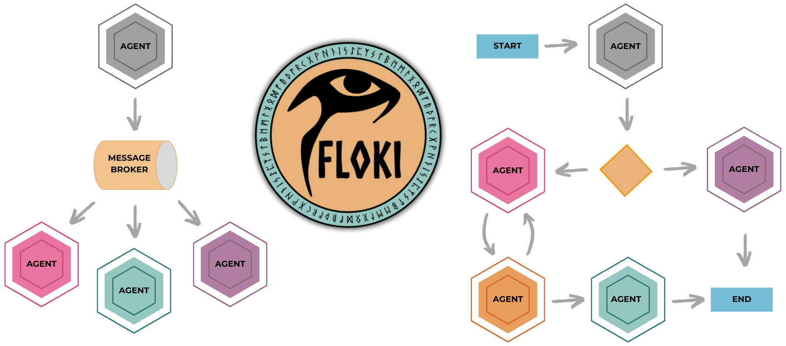

# Floki: Agentic Workflows Made Simple

[](https://pypi.python.org/pypi/floki-ai)
[](https://pypi.org/project/floki-ai/)
[](https://github.com/Cyb3rWard0g/floki)
[](https://github.com/Cyb3rWard0g/floki/blob/main/LICENSE)



> 🚧 Floki is in active development and evolving with ongoing research. APIs and core structures may change as the framework matures and Dapr integration is refined.

Floki is an open-source framework for researchers and developers to experiment with LLM-based autonomous agents. It provides tools to create, orchestrate, and manage agents while seamlessly connecting to LLM inference APIs. Built on [Dapr](https://docs.dapr.io/), Floki leverages a unified programming model that simplifies microservices and supports both deterministic workflows and event-driven interactions. Using Dapr’s Virtual Actor pattern, Floki enables agents to function as independent, self-contained units that process messages sequentially, eliminating concurrency concerns while seamlessly integrating into larger workflows. It also facilitates agent collaboration through Dapr’s Pub/Sub integration, where agents communicate via a shared message bus, simplifying the design of workflows where tasks are distributed efficiently, and agents work together to achieve shared goals. By bringing together these features, Floki provides a powerful way to explore agentic workflows and the components that enable multi-agent systems to collaborate and scale, all powered by Dapr.

## Documentation (WIP 🚧): https://cyb3rward0g.github.io/floki/

## Why Dapr 🎩?

[Dapr](https://docs.dapr.io/) provides Floki with a unified programming model that simplifies the development of resilient and scalable systems by offering built-in APIs for features such as service invocation, Pub/Sub messaging, workflows, and even state management. These components, essential for defining agentic workflows, allow developers to focus on designing agents and workflows rather than rebuilding foundational features. By leveraging Dapr’s sidecar architecture and portable, event-driven runtime, Floki also enables agents to collaborate effectively, share tasks, and adapt dynamically across cloud and edge environments. This seamless integration brings together deterministic workflows and LLM-based decision-making into a unified system, making it easier to experiment with multi-agent systems and scalable agentic workflows.

### Key Dapr Features in Floki:
* 🎯 **Service-to-Service Invocation**: Facilitates direct communication between agents with built-in service discovery, error handling, and distributed tracing. Agents can leverage this for synchronous messaging in multi-agent workflows.
* ⚡️ **Publish and Subscribe**: Supports loosely coupled collaboration between agents through a shared message bus. This enables real-time, event-driven interactions critical for task distribution and coordination.
* 🔄 **Workflow API**: Defines long-running, persistent workflows that combine deterministic processes with LLM-based decision-making. Floki uses this to orchestrate complex multi-step agentic workflows seamlessly.
* 🧠 **State Management**: Provides a flexible key-value store for agents to retain context across interactions, ensuring continuity and adaptability during workflows.
* 🤖 **Actors**: Implements the Virtual Actor pattern, allowing agents to operate as self-contained, stateful units that handle messages sequentially. This eliminates concurrency concerns and enhances scalability in Floki's agent systems.

## Install Floki ⚡️

Make sure you have Python already installed. `Python >=3.9`

### As a Python package using Pip

```bash
pip install floki-ai
```

### Remotely from GitHub

```bash
pip install git+https://github.com/Cyb3rWard0g/floki.git
```

### From source with `poetry`:

```bash
git clone https://github.com/Cyb3rWard0g/floki

cd floki

poetry install
```

## Install Dapr CLI

Install the [Dapr CLI](https://docs.dapr.io/getting-started/install-dapr-cli/) to manage Dapr-related tasks like running applications with sidecars, viewing logs, and launching the Dapr dashboard. It works seamlessly with both self-hosted and Kubernetes environments. For a complete step-by-step guide, visit the official [Dapr CLI installation page](https://docs.dapr.io/getting-started/install-dapr-cli/).

Verify the CLI is installed by restarting your terminal/command prompt and running the following:

```bash
dapr -h
```

### Initialize Dapr in Local Mode

Make sure you have [Docker](https://docs.docker.com/get-started/get-docker/) already installed. I use [Docker Desktop](https://www.docker.com/products/docker-desktop/).

Initialize Dapr locally to set up a self-hosted environment for development. This process installs Dapr sidecar binaries, runs essential services like Redis (state store and message broker) and Zipkin (observability), and prepares a default components folder. For detailed steps, see the official [guide on initializing Dapr locally](https://docs.dapr.io/getting-started/install-dapr-selfhost/).

To initialize the Dapr control plane containers and create a default configuration file, open an elevated terminal and run:

```bash
dapr init
```

Verify you have container instances with `daprio/dapr`, `openzipkin/zipkin`, and `redis` images running:

```bash
docker ps
```

## Acknowledgments
Floki was born out of a desire to explore and learn more about [Dapr](https://dapr.io/) and its potential for building agentic systems. I wanted to understand how to deploy agents as services, manage message communication, and connect various components effectively. Along the way, I looked to several established frameworks for ideas and guidance, which helped shape my thinking and approach:

* https://github.com/microsoft/autogen
* https://github.com/langchain-ai/langchain
* https://github.com/run-llama/llama_deploy

While these frameworks provided valuable insights, Floki is my unique take on how to leverage Dapr for agent-based workflows and systems. It reflects my learning journey and ongoing research in this exciting space.
