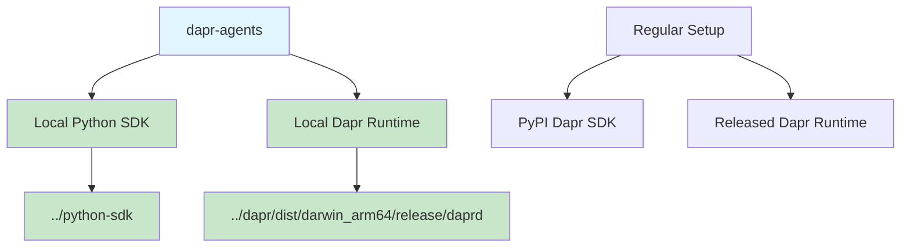

# Local Development Setup

This guide explains how to set up a local development environment for `dapr-agents` using local development versions of Dapr components instead of released versions. This is particularly useful when:

- 🚀 **Testing cutting-edge features** before they're officially released
- 🔧 **Contributing to Dapr** and testing your changes
- 🐛 **Debugging issues** with better visibility into Dapr internals
- ⚡ **Early access** to new APIs like streaming conversation

## Architecture Overview



## Prerequisites

### Required Directory Structure
Your workspace should be organized as follows:
```
parent-directory/
├── dapr/                    # Dapr runtime source code
├── dapr-cli/               # Dapr CLI source code  
├── python-sdk/             # Dapr Python SDK source code
└── dapr-agents/           # This project
```

### Build Requirements
- **Go 1.21+** (for building Dapr runtime)
- **Python 3.10+** (for Python SDK)
- **Make** (for build automation)

## Setup Instructions

### 1. Clone Required Repositories

```bash
# From your workspace parent directory
git clone https://github.com/dapr/dapr.git
git clone https://github.com/dapr/cli.git dapr-cli
git clone https://github.com/dapr/python-sdk.git
```

### 2. Build Local Dapr Runtime

```bash
cd dapr
make build TAGS=allcomponents
```

This creates the binary at `dist/darwin_arm64/release/daprd` (on macOS ARM64).

### 3. Install Local Python SDK

```bash
cd ../dapr-agents
pip uninstall dapr -y
pip install -e ../python-sdk
```

### 4. Verify Installation

```bash
# Check Python SDK version
python -c "import dapr; print(dapr.__version__)"
# Should show: 1.15.0.dev0

# Check for streaming methods
python -c "from dapr.clients import DaprClient; client = DaprClient(); print([m for m in dir(client) if 'stream' in m.lower()])"
# Should show: ['converse_stream_alpha1', 'converse_stream_json']
```

## Using the Enhanced start_dapr.sh Script

The `start_dapr.sh` script provides flexible options for running either local development or regular release versions of Dapr.

### Command Options

| Flag | Description | Example |
|------|-------------|---------|
| `--dev`, `-d` | Use local development Dapr | `./start_dapr.sh --dev` |
| `--release`, `-r` | Use regular release Dapr (default) | `./start_dapr.sh --release` |
| `--build`, `-b` | Build local Dapr before running | `./start_dapr.sh --dev --build` |
| `--help`, `-h` | Show help message | `./start_dapr.sh --help` |

### Usage Examples

```bash
# Use regular release Dapr (default behavior)
./start_dapr.sh

# Use local development Dapr
./start_dapr.sh --dev

# Build and use local development Dapr
./start_dapr.sh --dev --build

# Get help
./start_dapr.sh --help
```

### Script Features

- ✅ **Automatic binary detection** and validation
- ✅ **Build integration** with proper tags
- ✅ **Health checks** to ensure Dapr is ready
- ✅ **Error handling** with helpful troubleshooting tips
- ✅ **Colored output** for better visibility

## Development Workflow

### 1. Start Local Development Environment

```bash
# Terminal 1: Start local Dapr
./start_dapr.sh --dev

# Terminal 2: Run your application
python your_app.py
```

### 2. Test Streaming Features

```bash
# Test the streaming conversation API
python test_streaming_with_dapr.py
```

Expected output:
```
🧪 Testing Dapr Streaming with Live Sidecar
==================================================
1. Initializing DaprChatClient...
   ✅ Client initialized successfully

2. Testing non-streaming conversation...
   ✅ Non-streaming response received in 0.00s

3. Testing streaming conversation...
   🚀 Starting streaming conversation...
   🤖 Assistant: Hello from streaming test!
   💰 Usage: {'prompt_tokens': 20, 'completion_tokens': 20, 'total_tokens': 40}
   ✅ Streaming completed in 0.08s
```

### 3. Iterative Development

```bash
# Make changes to Dapr source code
cd ../dapr
# ... edit source files ...

# Rebuild and restart
make build TAGS=allcomponents
cd ../dapr-agents
./start_dapr.sh --dev
```

## Key Differences: Local vs Release

| Aspect | Local Development | Regular Release |
|--------|-------------------|-----------------|
| **Version** | `dev` (latest commit) | `1.15.5` (stable) |
| **Features** | Cutting-edge, experimental | Stable, tested |
| **APIs** | `converse_stream_alpha1()` ✅ | Not available ❌ |
| **Debugging** | Full source access | Limited visibility |
| **Performance** | Latest optimizations | Production-tested |
| **Stability** | May have bugs | Battle-tested |

## Troubleshooting

### Common Issues

#### 1. "converse_stream_alpha1 not found"
```bash
# Cause: Using regular PyPI SDK instead of local
# Solution: Reinstall local SDK
pip uninstall dapr -y
pip install -e ../python-sdk
```

#### 2. "daprd binary not found"
```bash
# Cause: Dapr not built or wrong path
# Solution: Build Dapr with correct tags
cd ../dapr
make build TAGS=allcomponents
```

#### 3. "config.yaml not found"
```bash
# Cause: Temporary directory issues
# Solution: Use direct daprd execution (handled by script)
./start_dapr.sh --dev
```

#### 4. Import errors with local SDK
```bash
# Check installation
pip show dapr-dev
# Should show Location pointing to ../python-sdk

# Reinstall if needed
pip install -e ../python-sdk --force-reinstall
```

### Health Checks

```bash
# Check Dapr health
curl http://localhost:3500/v1.0/healthz

# Check components loaded
curl http://localhost:3500/v1.0/metadata

# Test conversation API
python -c "
from dapr.clients import DaprClient
with DaprClient() as client:
    print('✅ Dapr client connected')
    print('📋 Available methods:', [m for m in dir(client) if 'converse' in m])
"
```

## Benefits of Local Development

### 🚀 **Early Access to Features**
- Test streaming APIs before official release
- Experiment with alpha/beta functionality
- Validate new features against your use cases

### 🔧 **Enhanced Debugging**
- Full source code access for troubleshooting
- Custom logging and instrumentation
- Step-through debugging of Dapr internals

### ⚡ **Rapid Iteration**
- Immediate testing of Dapr changes
- No waiting for releases
- Custom patches and optimizations

### 🧪 **Advanced Testing**
- Test against latest Dapr commits
- Validate compatibility early
- Contribute back improvements

## Integration with dapr-agents

### Streaming Chat Completion

```python
from dapr_agents.llm.dapr import DaprChatClient

# Local development enables streaming
client = DaprChatClient()
messages = [{"role": "user", "content": "Hello!"}]

# This works with local development setup
for chunk in client.generate(messages=messages, stream=True):
    if chunk.get("type") == "content":
        print(chunk["data"], end="", flush=True)
```

### Agent Patterns

```python
from dapr_agents.agent.patterns.react import ReactAgent
from dapr_agents.llm.dapr import DaprChatClient

# Enhanced with local streaming capabilities
agent = ReactAgent(
    llm_client=DaprChatClient(),
    name="StreamingAgent",
    # ... other config
)

# Streaming responses in agent interactions
response = agent.run("Analyze this data...", stream=True)
```

## Best Practices

### Development Workflow
1. **Start with stable**: Begin development with release versions
2. **Switch to local**: Move to local development for specific features
3. **Test thoroughly**: Validate both streaming and non-streaming paths
4. **Document changes**: Keep track of local modifications
5. **Contribute back**: Share improvements with the community

### Version Management
```bash
# requirements.txt for local development
# dapr>=1.15.0  # Comment out regular version
-e ../python-sdk  # Use local development version
```

### Environment Variables
```bash
# .env file for local development
DAPR_HTTP_PORT=3500
DAPR_GRPC_PORT=50001
DAPR_LLM_COMPONENT_DEFAULT=echo
LOCAL_DEV_MODE=true
```

## Migration Path

### From Release to Local Development

```bash
# 1. Stop current Dapr
dapr stop --app-id your-app

# 2. Switch to local setup
pip uninstall dapr -y
pip install -e ../python-sdk

# 3. Start local Dapr
./start_dapr.sh --dev

# 4. Test your application
python your_app.py
```

### Back to Release

```bash
# 1. Stop local Dapr
pkill -f daprd

# 2. Reinstall release version
pip uninstall dapr-dev -y
pip install dapr>=1.15.0

# 3. Start release Dapr
./start_dapr.sh --release
```

---

## Summary

Local development setup provides powerful capabilities for advanced Dapr development:

- 🎯 **Access to latest features** like streaming conversation API
- 🔬 **Deep debugging** capabilities with full source access  
- ⚡ **Rapid iteration** for testing changes
- 🚀 **Cutting-edge development** before official releases

The enhanced `start_dapr.sh` script makes switching between local and release versions seamless, enabling flexible development workflows that match your specific needs. 