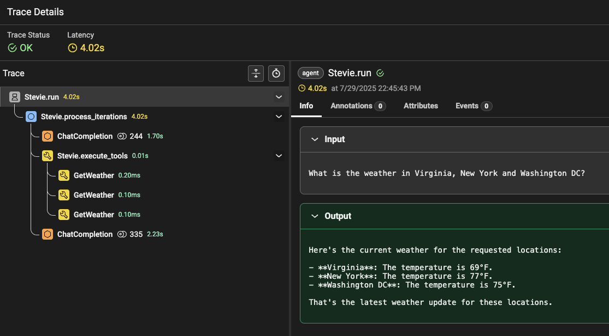
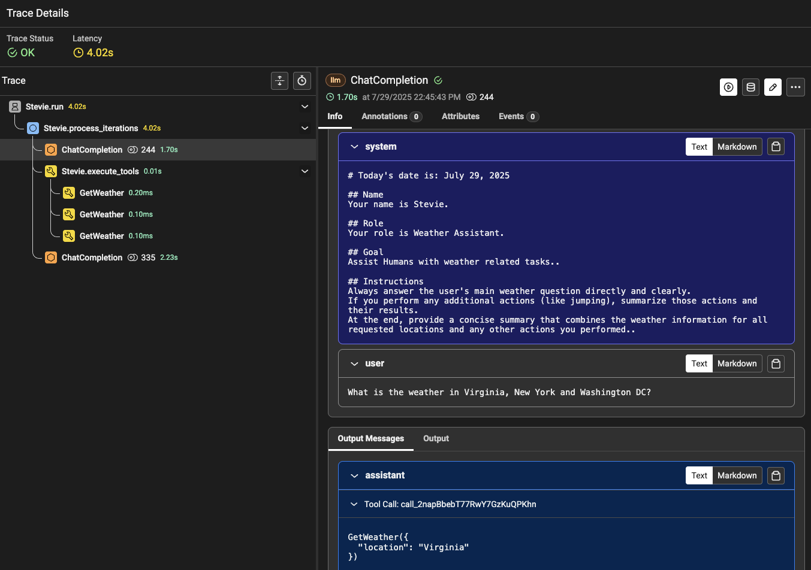

# Agent Tool Call with Dapr Agents

This quickstart demonstrates how to create an AI agent with custom tools using Dapr Agents. You'll learn how to build a weather assistant that can fetch information and perform actions using defined tools through LLM-powered function calls.

## Prerequisites

- Python 3.10 (recommended)
- pip package manager
- OpenAI API key

## Environment Setup

```bash
# Create a virtual environment
python3.10 -m venv .venv

# Activate the virtual environment 
# On Windows:
.venv\Scripts\activate
# On macOS/Linux:
source .venv/bin/activate

# Install dependencies
pip install -r requirements.txt
```

## Configuration

The quickstart includes an OpenAI component configuration in the `components` directory. You have two options to configure your API key:

### Option 1: Using Environment Variables (Recommended)

1. Create a `.env` file in the project root and add your OpenAI API key:
```env
OPENAI_API_KEY=your_api_key_here
```

2. When running the examples with Dapr, use the helper script to resolve environment variables:
```bash
# Get the environment variables from the .env file:
export $(grep -v '^#' ../../.env | xargs)

# Create a temporary resources folder with resolved environment variables
temp_resources_folder=$(../resolve_env_templates.py ./components)

# Run your dapr command with the temporary resources
dapr run --app-id weatheragent --resources-path $temp_resources_folder -- python weather_agent_dapr.py

# Clean up when done
rm -rf $temp_resources_folder
```

Note: The temporary resources folder will be automatically deleted when the Dapr sidecar is stopped or when the computer is restarted.

### Option 2: Direct Component Configuration

You can directly update the `key` in [components/openai.yaml](components/openai.yaml):
```yaml
apiVersion: dapr.io/v1alpha1
kind: Component
metadata:
  name: openai
spec:
  type: conversation.openai
  metadata:
    - name: key
      value: "YOUR_OPENAI_API_KEY"
```

Replace `YOUR_OPENAI_API_KEY` with your actual OpenAI API key.

Note: Many LLM providers are compatible with OpenAI's API (DeepSeek, Google AI, etc.) and can be used with this component by configuring the appropriate parameters. Dapr also has [native support](https://docs.dapr.io/reference/components-reference/supported-conversation/) for other providers like Google AI, Anthropic, Mistral, DeepSeek, etc.

## Examples

### Tool Creation and Agent Execution

This example shows how to create tools and an agent that can use them:

1. First, create the tools in `weather_tools.py`:

```python
from dapr_agents import tool
from pydantic import BaseModel, Field

class GetWeatherSchema(BaseModel):
    location: str = Field(description="location to get weather for")

@tool(args_model=GetWeatherSchema)
def get_weather(location: str) -> str:
    """Get weather information based on location."""
    import random
    temperature = random.randint(60, 80)
    return f"{location}: {temperature}F."

class JumpSchema(BaseModel):
    distance: str = Field(description="Distance for agent to jump")

@tool(args_model=JumpSchema)
def jump(distance: str) -> str:
    """Jump a specific distance."""
    return f"I jumped the following distance {distance}"

tools = [get_weather, jump]
```

2. Then, create the agent in `weather_agent.py`:

```python
import asyncio
from weather_tools import tools
from dapr_agents import Agent
from dotenv import load_dotenv

load_dotenv()

AIAgent = Agent(
    name="Stevie",
    role="Weather Assistant",
    goal="Assist Humans with weather related tasks.",
    instructions=[
        "Always answer the user's main weather question directly and clearly.",
        "If you perform any additional actions (like jumping), summarize those actions and their results.",
        "At the end, provide a concise summary that combines the weather information for all requested locations and any other actions you performed.",
    ],
    tools=tools
)

# Wrap your async call
async def main():
    await AIAgent.run("What is the weather in Virginia, New York and Washington DC?")

if __name__ == "__main__":
    asyncio.run(main())
```

3. Run the weather agent:

<!-- STEP
name: Run text completion example
expected_stdout_lines:
  - "user:"
  - "What is the weather in Virginia, New York and Washington DC?"
  - "assistant:"
  - "Function name: GetWeather (Call Id:"
  - 'Arguments: {"location":'
  - "assistant:"
  - "Function name: GetWeather (Call Id:"
  - 'Arguments: {"location":'
  - "assistant:"
  - "Function name: GetWeather (Call Id:"
  - 'Arguments: {"location":'
  - "GetWeather(tool)"
  - "Virginia"
  - "GetWeather(tool)"
  - "New York"
  - "GetWeather(tool)"
  - "Washington DC"
timeout_seconds: 30
output_match_mode: substring
-->
```bash
python weather_agent.py
```
<!-- END_STEP -->

**Expected output:** The agent will identify the locations and use the get_weather tool to fetch weather information for each city.

**Other Examples:** You can also try the following agents with the same tools using `HuggingFace hub` and `NVIDIA` LLM chat clients. Make sure you add the `HUGGINGFACE_API_KEY` and `NVIDIA_API_KEY` to the `.env` file.
- [HuggingFace Agent](./weather_agent_hf.py)
- [NVIDIA Agent](./weather_agent_nv.py)

## Key Concepts

### Tool Definition
- The `@tool` decorator registers functions as tools with the agent
- Each tool has a docstring that helps the LLM understand its purpose
- Pydantic models provide type-safety for tool arguments

### Agent Setup
- The `Agent` class sets up a tool-calling agent by default
- The `role`, `goal`, and `instructions` guide the agent's behavior
- Tools are provided as a list for the agent to use
- Agent Memory keeps the conversation history that the agent can reference


### Execution Flow
1. The agent receives a user query
2. The LLM determines which tool(s) to use based on the query
3. The agent executes the tool with appropriate arguments
4. The results are returned to the LLM to formulate a response
5. The final answer is provided to the user

## Working with Agent Memory

You can access and manage the agent's conversation history too. Add this code fragment to the end of `weather_agent.py` and run it again.

```python
# View the history after first interaction
print("Chat history after first interaction:")
print(AIAgent.chat_history)

# Second interaction (agent will remember the first one)
await AIAgent.run("How about in Seattle?")

# View updated history
print("Chat history after second interaction:")
print(AIAgent.chat_history)

# Reset memory
AIAgent.reset_memory()
print("Chat history after reset:")
print(AIAgent.chat_history)  # Should be empty now
```
This will show agent interaction history growth and reset.

### Persistent Agent Memory

Dapr Agents allows for agents to retain long-term memory by providing automatic state management of the history. The state can be saved into a wide variety of [Dapr supported state stores](https://docs.dapr.io/reference/components-reference/supported-state-stores/).

To configure persistent agent memory, follow these steps:

1. Set up the state store configuration. Here's an example of working with local Redis:

```yaml
apiVersion: dapr.io/v1alpha1
kind: Component
metadata:
  name: historystore
spec:
  type: state.redis
  version: v1
  metadata:
  - name: redisHost
    value: localhost:6379
  - name: redisPassword
    value: ""
```

Save the file in a `./components` dir.

2. Enable Dapr memory in code

```python
import asyncio
from weather_tools import tools
from dapr_agents import Agent
from dotenv import load_dotenv
from dapr_agents.memory import ConversationDaprStateMemory

load_dotenv()

AIAgent = Agent(
    name="Stevie",
    role="Weather Assistant",
    goal="Assist Humans with weather related tasks.",
    instructions=[
        "Always answer the user's main weather question directly and clearly.",
        "If you perform any additional actions (like jumping), summarize those actions and their results.",
        "At the end, provide a concise summary that combines the weather information for all requested locations and any other actions you performed.",
    ],
    memory=ConversationDaprStateMemory(store_name="historystore", session_id="some-id"),
    tools=tools
)

# Wrap your async call
async def main():
    await AIAgent.run("What is the weather in Virginia, New York and Washington DC?")

if __name__ == "__main__":
    asyncio.run(main())
```

3. Run the agent with Dapr

```bash
dapr run --app-id weatheragent --resources-path ./components -- python weather_agent_dapr.py
```

## Observability with Phoenix Arize

This section demonstrates how to add observability to your Dapr Agents using Phoenix Arize for distributed tracing and monitoring. You'll learn how to set up Phoenix with PostgreSQL backend and instrument your agent for comprehensive observability.

### Phoenix Server Setup

First, deploy Phoenix Arize server using Docker Compose with PostgreSQL backend for persistent storage.

#### Prerequisites

- Docker and Docker Compose installed on your system
- Verify Docker is running: `docker info`

#### Deploy Phoenix with PostgreSQL

1. Use the provided [docker-compose.yml](./docker-compose.yml) file to set up a Phoenix server locally with PostgreSQL backend.
2. Start the Phoenix server:

```bash
docker compose up --build
```

3. Verify Phoenix is running by navigating to [http://localhost:6006](http://localhost:6006)

#### Note on Production Deployment
For production deployments, ensure you:
- Use persistent volumes for PostgreSQL data
- Configure proper authentication and security
- Pin Phoenix version (e.g., `arizephoenix/phoenix:4.0.0`)

### Agent Observability Setup

#### Install Observability Dependencies

Install the updated requirements:

```bash
pip install -r requirements.txt
```

#### Instrumented Weather Agent

Create `weather_agent_tracing.py` with Phoenix OpenTelemetry integration:

```python
import asyncio
from weather_tools import tools
from dapr_agents import Agent
from dotenv import load_dotenv

load_dotenv()

AIAgent = Agent(
    name="Stevie",
    role="Weather Assistant", 
    goal="Assist Humans with weather related tasks.",
    instructions=[
        "Always answer the user's main weather question directly and clearly.",
        "If you perform any additional actions (like jumping), summarize those actions and their results.",
        "At the end, provide a concise summary that combines the weather information for all requested locations and any other actions you performed.",
    ],
    tools=tools,
)

# Wrap your async call
async def main():
    from phoenix.otel import register
    from dapr_agents.observability import DaprAgentsInstrumentor

    # Register Dapr Agents with Phoenix OpenTelemetry
    tracer_provider = register(
        project_name="dapr-weather-agents",
        protocol="http/protobuf",
    )
    
    # Initialize Dapr Agents OpenTelemetry instrumentor
    instrumentor = DaprAgentsInstrumentor()
    instrumentor.instrument(tracer_provider=tracer_provider, skip_dep_check=True)

    await AIAgent.run("What is the weather in Virginia, New York and Washington DC?")

if __name__ == "__main__":
    asyncio.run(main())
```

Alternatively, you can use the DurableAgent with this same setup using `weather_durable_agent_tracing.py`.

#### Run with Observability

1. Ensure Phoenix server is running (see setup steps above)

2. Run the instrumented agent:

```bash
python weather_agent_tracing.py
```

Alternatively, you can run the DurableAgent using:
```bash
dapr run --app-id weatheragent --resources-path ./components -- python weather_durable_agent_tracing.py
```

3. View traces in Phoenix UI at [http://localhost:6006](http://localhost:6006)





### Observability Features

Dapr Agents observability provides:

- **W3C Trace Context**: Standards-compliant distributed tracing
- **OpenTelemetry Integration**: Industry-standard instrumentation
- **Phoenix UI Compatibility**: Rich visualization and analysis
- **Automatic Instrumentation**: Zero-code tracing for agents and tools
- **Performance Monitoring**: Detailed metrics and performance insights
- **Error Tracking**: Comprehensive error capture and analysis

### Troubleshooting Observability

1. **Phoenix Connection Issues**: 
   - Verify Phoenix server is running: `docker compose ps`
   - Check port availability: `netstat -an | grep 6006`

2. **Missing Traces**:
   - Ensure `dapr-agents[observability]` is installed
   - Verify instrumentation is called before agent execution

3. **Docker Issues**:
   - Check Docker daemon is running: `docker info`
   - Verify PostgreSQL connectivity: `docker compose logs db`

## Available Agent Types

Dapr Agents provides two agent implementations, each designed for different use cases:

### 1. Agent
The default agent type, designed for tool execution and straightforward interactions. It receives your input, determines which tools to use, executes them directly, and provides the final answer. The reasoning process is mostly hidden from you, focusing instead on delivering concise responses.

### 2. DurableAgent
The DurableAgent class is a workflow-based agent that extends the standard Agent with Dapr Workflows for long-running, fault-tolerant, and durable execution. It provides persistent state management, automatic retry mechanisms, and deterministic execution across failures. We will see this agent in the next example: [Durable Agent](../03-durable-agent-tool-call/).

## Troubleshooting

1. **OpenAI API Key**: Ensure your key is correctly set in the `.env` file
2. **Tool Execution Errors**: Check tool function implementations for exceptions
3. **Module Import Errors**: Verify that requirements are installed correctly

## Next Steps

After completing this quickstart, move on to the [Agentic Workflow quickstart](../04-agentic-workflow/README.md) to learn how to orchestrate multi-step processes combining deterministic tasks with LLM-powered reasoning.