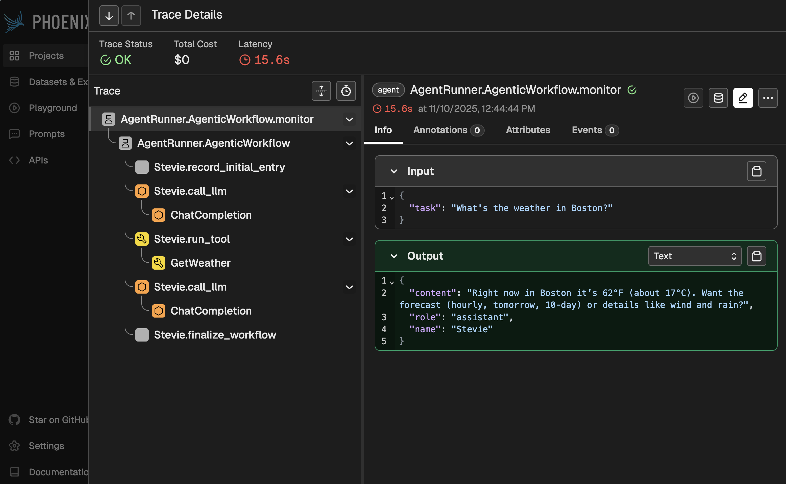

# Durable Agent Tool Call with Dapr Agents

This quickstart demonstrates how to create a **Durable Agent** with custom tools using Dapr Agents. You'll learn how to build a weather assistant that can fetch information and perform actions using defined tools through LLM-powered function calls, with stateful and durable execution.

## Prerequisites

- Python 3.10 (recommended)
- pip package manager
- OpenAI API key

## Environment Setup

```bash
# Create a virtual environment
python3.10 -m venv .venv

# Activate the virtual environment 
# On Windows:
.venv\Scripts\activate
# On macOS/Linux:
source .venv/bin/activate

# Install dependencies
pip install -r requirements.txt
```

## Configuration

The quickstart includes an OpenAI component configuration in the `components` directory. You have two options to configure your API key:

### Option 1: Using Environment Variables (Recommended)

1. Create a `.env` file in the project root and add your OpenAI API key:
```env
OPENAI_API_KEY=your_api_key_here
```

2. When running the examples with Dapr, use the helper script to resolve environment variables:
```bash
# Get the environment variables from the .env file:
export $(grep -v '^#' ../../.env | xargs)

# Create a temporary resources folder with resolved environment variables
temp_resources_folder=$(../resolve_env_templates.py ./components)

# Run your dapr command with the temporary resources
dapr run --app-id durableweatherapp --resources-path $temp_resources_folder -- python durable_weather_agent.py

# Clean up when done
rm -rf $temp_resources_folder
```

Note: The temporary resources folder will be automatically deleted when the Dapr sidecar is stopped or when the computer is restarted.

### Option 2: Direct Component Configuration

You can directly update the `key` in [components/openai.yaml](components/openai.yaml):
```yaml
apiVersion: dapr.io/v1alpha1
kind: Component
metadata:
  name: openai
spec:
  type: conversation.openai
  metadata:
    - name: key
      value: "YOUR_OPENAI_API_KEY"
```

Replace `YOUR_OPENAI_API_KEY` with your actual OpenAI API key.

Note: Many LLM providers are compatible with OpenAI's API (DeepSeek, Google AI, etc.) and can be used with this component by configuring the appropriate parameters. Dapr also has [native support](https://docs.dapr.io/reference/components-reference/supported-conversation/) for other providers like Google AI, Anthropic, Mistral, DeepSeek, etc.

### Additional Components

The quickstart includes other necessary Dapr components in the `components` directory:

- `statestore.yaml`: Agent state configuration
- `pubsub.yaml`: Pub/Sub message bus configuration
- `workflowstate.yaml`: Workflow state configuration

Make sure Dapr is initialized on your system:

```bash
dapr init
```

## Example: DurableAgent Usage

```python
from dapr_agents import DurableAgent
from dotenv import load_dotenv
from weather_tools import tools
import asyncio
import logging

async def main():
    load_dotenv()
    logging.basicConfig(level=logging.INFO)

    weather_agent = DurableAgent(
        role="Weather Assistant",
        name="Stevie",
        goal="Help humans get weather and location info using smart tools.",
        instructions=[
            "Respond clearly and helpfully to weather-related questions.",
            "Use tools when appropriate to fetch weather data."
        ],
        message_bus_name="messagepubsub",
        state_store_name="workflowstatestore",
        state_key="workflow_state",
        agents_registry_store_name="agentstatestore",
        agents_registry_key="agents_registry",
        tools=tools,
    )
    await weather_agent.run("What's the weather in Boston tomorrow?")

if __name__ == "__main__":
    asyncio.run(main())
```

## Running the Example

start the agent with Dapr:

```bash
dapr run --app-id durableweatherapp --resources-path ./components -- python durable_weather_agent.py
```

## Other Durable Agent
You can also try the following Durable agents with the same tools using `HuggingFace hub` and `NVIDIA` LLM chat clients. Make sure you add the `HUGGINGFACE_API_KEY` and `NVIDIA_API_KEY` to the `.env` file.
- [HuggingFace Durable Agent](./durable_weather_agent_hf.py)
- [NVIDIA Durable Agent](./durable_weather_agent_nv.py)

## About Durable Agents

Durable agents maintain state across runs, enabling workflows that require persistence, recovery, and coordination. This is useful for long-running tasks, multi-step workflows, and agent collaboration.

## Custom Tools Example

See `weather_tools.py` for sample tool definitions.

## Observability with Phoenix Arize

This section demonstrates how to add observability to your Dapr Agents using Phoenix Arize for distributed tracing and monitoring. You'll learn how to set up Phoenix with PostgreSQL backend and instrument your agent for comprehensive observability.

### Phoenix Server Setup

First, deploy Phoenix Arize server using Docker Compose with PostgreSQL backend for persistent storage.

#### Prerequisites

- Docker and Docker Compose installed on your system
- Verify Docker is running: `docker info`

#### Deploy Phoenix with PostgreSQL

1. Use the provided [docker-compose.yml](./docker-compose.yml) file to set up a Phoenix server locally with PostgreSQL backend.
2. Start the Phoenix server:

```bash
docker compose up --build
```

3. Verify Phoenix is running by navigating to [http://localhost:6006](http://localhost:6006)

#### Note on Production Deployment
For production deployments, ensure you:
- Use persistent volumes for PostgreSQL data
- Configure proper authentication and security
- Pin Phoenix version (e.g., `arizephoenix/phoenix:4.0.0`)

### Durable Agent Observability Setup

#### Install Observability Dependencies

Install the updated requirements:

```bash
pip install -r requirements.txt
```

#### Instrumented Weather Agent

Create `durable_weather_agent_tracing.py` with Phoenix OpenTelemetry integration:

```python
import asyncio
import logging

from dotenv import load_dotenv
from weather_tools import tools

from dapr_agents import DurableAgent

logging.basicConfig(level=logging.INFO)

load_dotenv()

async def main():
    from phoenix.otel import register

    # Register OpenTelemetry tracer provider
    tracer_provider = register(
        project_name="dapr-agentic-workflows",
        protocol="http/protobuf",
    )
    # Initialize Dapr Agents observability instrumentor
    from dapr_agents.observability import DaprAgentsInstrumentor
    instrumentor = DaprAgentsInstrumentor()
    instrumentor.instrument(tracer_provider=tracer_provider, skip_dep_check=True)

    # 1️⃣ Instantiate your agent
    weather_agent = DurableAgent(
        role="Weather Assistant",
        name="Stevie",
        goal="Help humans get weather and location info using smart tools.",
        instructions=[
            "Respond clearly and helpfully to weather-related questions.",
            "Use tools when appropriate to fetch weather data.",
        ],
        message_bus_name="messagepubsub",
        state_store_name="workflowstatestore",
        state_key="workflow_state",
        agents_registry_store_name="agentstatestore",
        agents_registry_key="agents_registry",
        tools=tools,
    )
    # 2️⃣ Start the agent service
    result = await weather_agent.run("What's the weather in Boston?")

    print(f"\n🎯 Final result: {result}")
    print("📊 Check Phoenix UI at http://localhost:6006 for traces")
    
    return result

if __name__ == "__main__":
    asyncio.run(main())
```

#### Run with Observability

1. Ensure Phoenix server is running (see setup steps above)

2. Run the instrumented Durable Agent:

```bash
dapr run --app-id durableweatherapptracing --resources-path ./components -- python durable_weather_agent_tracing.py
```

3. View traces in Phoenix UI at [http://localhost:6006](http://localhost:6006)




### Observability Features

Dapr Agents observability provides:

- **W3C Trace Context**: Standards-compliant distributed tracing
- **OpenTelemetry Integration**: Industry-standard instrumentation
- **Phoenix UI Compatibility**: Rich visualization and analysis
- **Automatic Instrumentation**: Zero-code tracing for agents and tools
- **Performance Monitoring**: Detailed metrics and performance insights
- **Error Tracking**: Comprehensive error capture and analysis

### Troubleshooting Observability

1. **Phoenix Connection Issues**: 
   - Verify Phoenix server is running: `docker compose ps`
   - Check port availability: `netstat -an | grep 6006`

2. **Missing Traces**:
   - Ensure `dapr-agents[observability]` is installed
   - Verify instrumentation is called before agent execution

3. **Docker Issues**:
   - Check Docker daemon is running: `docker info`
   - Verify PostgreSQL connectivity: `docker compose logs db`