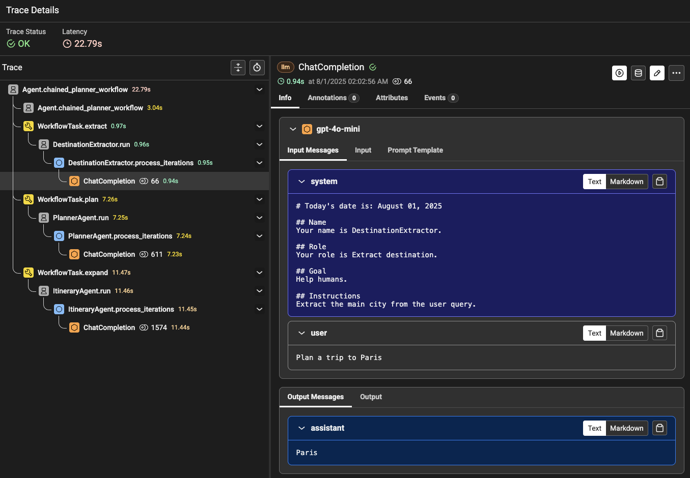
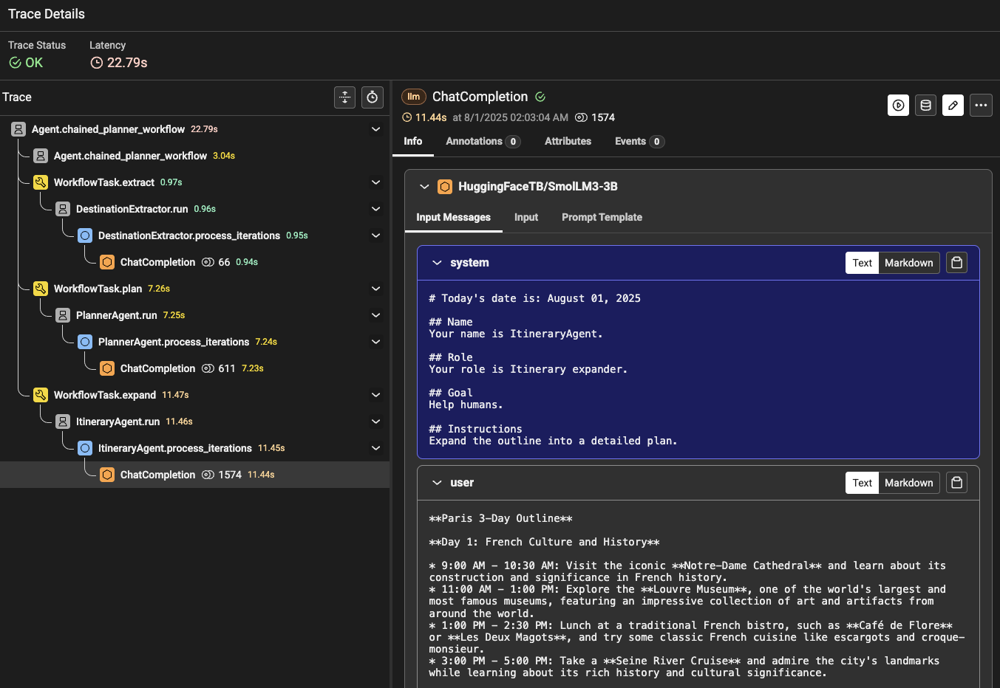

# Agents as Tasks in Workflows with Dapr Agents

This quickstart demonstrates how to use AI agents as tasks within Dapr workflows, enabling sophisticated orchestration of agent-based automation. You'll learn how to build resilient, stateful workflows that leverage agents for intelligent task execution, decision-making, and multi-step reasoning.

## Prerequisites

- Python 3.10 (recommended)
- pip package manager
- OpenAI API key (or NVIDIA API key and Hugging Face API key for multi-model examples)
- Dapr CLI and Docker installed

## Environment Setup

```bash
# Create a virtual environment
python3.10 -m venv .venv

# Activate the virtual environment
# On Windows:
.venv\Scripts\activate
# On macOS/Linux:
source .venv/bin/activate

# Install dependencies
pip install -r requirements.txt
```

## Configuration

1. Create a `.env` file in the project root:

```env
OPENAI_API_KEY=your_openai_api_key_here
NVIDIA_API_KEY=your_nvidia_api_key_here  # Optional, for multi-model examples
HUGGINGFACE_API_KEY=your_huggingface_api_key_here  # Optional, for multi-model examples
```

2. Replace the API keys with your actual keys.

3. Make sure Dapr is initialized on your system:

```bash
dapr init
```

4. Create the workflow state store component:

Look at the `workflowstate.yaml` file in the `components` directory:

```yaml
apiVersion: dapr.io/v1alpha1
kind: Component
metadata:
  name: workflowstatestore
spec:
  type: state.redis
  version: v1
  metadata:
  - name: redisHost
    value: localhost:6379
  - name: redisPassword
    value: ""
  - name: actorStateStore
    value: "true"
```

## Sequential Agent Workflow

This example demonstrates how to use agents as tasks in a sequential workflow for trip planning:

```python
from dapr_agents.workflow import WorkflowApp, workflow, task
from dapr.ext.workflow import DaprWorkflowContext
from dapr_agents import Agent
from dapr_agents.types import AssistantMessage
from dotenv import load_dotenv

# Load environment variables
load_dotenv()

# Define simple agents
extractor = Agent(
    name="DestinationExtractor",
    role="Extract destination",
    instructions=["Extract the main city from the user query"]
)

planner = Agent(
    name="PlannerAgent",
    role="Outline planner",
    instructions=["Generate a 3-day outline for the destination"]
)

expander = Agent(
    name="ItineraryAgent",
    role="Itinerary expander",
    instructions=["Expand the outline into a detailed plan"]
)

# Define tasks with agents
@task(agent=extractor)
def extract(user_msg: str) -> AssistantMessage:
    pass

@task(agent=planner)
def plan(destination: str) -> AssistantMessage:
    pass

@task(agent=expander)
def expand(outline: str) -> AssistantMessage:
    pass

# Orchestration
@workflow(name="chained_planner_workflow")
def chained_planner_workflow(ctx: DaprWorkflowContext, user_msg: str):
    dest = yield ctx.call_activity(extract, input=user_msg)
    outline = yield ctx.call_activity(plan, input=dest['content'])
    itinerary = yield ctx.call_activity(expand, input=outline['content'])
    return itinerary['content']

if __name__ == "__main__":
    wfapp = WorkflowApp()
    
    results = wfapp.run_and_monitor_workflow_sync(chained_planner_workflow, input="Plan a trip to Paris")
    print(f"Trip Itinerary: {results}")
```

Run the sequential agent workflow:

```bash
dapr run --app-id agent-workflow --resources-path components/ -- python sequential_workflow.py
```

**How it works:**
1. The `extract` task uses an agent to extract the destination from the user query
2. The `plan` task uses a different agent to create a 3-day outline for that destination  
3. The `expand` task uses a third agent to expand the outline into a detailed itinerary
4. Each agent has specialized instructions and capabilities for its specific role

## Observability with Phoenix Arize

This section demonstrates how to add observability to your Dapr Agent workflows using Phoenix Arize for distributed tracing and monitoring. You'll learn how to set up Phoenix with PostgreSQL backend and instrument your workflow for comprehensive observability.

### Phoenix Server Setup

First, deploy Phoenix Arize server using Docker Compose with PostgreSQL backend for persistent storage.

#### Prerequisites

- Docker and Docker Compose installed on your system
- Verify Docker is running: `docker info`

#### Deploy Phoenix with PostgreSQL

1. Use the [docker-compose.yml](./docker-compose.yml) file provided to set up a Phoenix server locally with PostgreSQL backend.

2. Start the Phoenix server:

```bash
docker compose up --build
```

3. Verify Phoenix is running by navigating to [http://localhost:6006](http://localhost:6006)

#### Install Observability Dependencies

Install the updated requirements:

```bash
pip install -r requirements.txt
```

### Examples

#### 1. Sequential Agent Workflow with Tracing

This example adds observability to the sequential workflow using Phoenix Arize for distributed tracing:

```python
from dapr.ext.workflow import DaprWorkflowContext
from dotenv import load_dotenv
from phoenix.otel import register

from dapr_agents import Agent
from dapr_agents.observability import DaprAgentsInstrumentor
from dapr_agents.types import AssistantMessage
from dapr_agents.workflow import WorkflowApp, task, workflow

# Load environment variables
load_dotenv()

# Register Dapr Agents with Phoenix OpenTelemetry
tracer_provider = register(
    project_name="dapr-agent-workflows",
    protocol="http/protobuf",
)
# Initialize Dapr Agents OpenTelemetry instrumentor
instrumentor = DaprAgentsInstrumentor()
instrumentor.instrument(tracer_provider=tracer_provider, skip_dep_check=True)

# Define agents and workflow (same as above)
# ... agent definitions ...

if __name__ == "__main__":
    wfapp = WorkflowApp()
    
    results = wfapp.run_and_monitor_workflow_sync(chained_planner_workflow, input="Plan a trip to Paris")
    print(f"Trip Itinerary: {results}")
```

Run with tracing:

```bash
dapr run --app-id agent-workflow-tracing --resources-path components/ -- python sequential_workflow_tracing.py
```

View traces in Phoenix UI at [http://localhost:6006](http://localhost:6006)


#### 2. Multi-Model Sequential Workflow with Tracing

This example demonstrates using multiple LLM providers within a single workflow, with full observability:

```python
from dapr.ext.workflow import DaprWorkflowContext
from dotenv import load_dotenv
from phoenix.otel import register

from dapr_agents import Agent, OpenAIChatClient, NVIDIAChatClient, HFHubChatClient
from dapr_agents.observability import DaprAgentsInstrumentor
from dapr_agents.types import AssistantMessage
from dapr_agents.workflow import WorkflowApp, task, workflow

# Load environment variables
load_dotenv()

# Register observability
tracer_provider = register(
    project_name="dapr-multi-model-agents",
    protocol="http/protobuf",
)
instrumentor = DaprAgentsInstrumentor()
instrumentor.instrument(tracer_provider=tracer_provider, skip_dep_check=True)

# Define agents with different LLM providers
extractor = Agent(
    name="DestinationExtractor",
    role="Extract destination",
    instructions=["Extract the main city from the user query"],
    llm=OpenAIChatClient(model="gpt-4o-mini")  # Using OpenAI
)

planner = Agent(
    name="PlannerAgent", 
    role="Outline planner",
    instructions=["Generate a 3-day outline for the destination"],
    llm=NVIDIAChatClient(model="meta/llama-3.1-8b-instruct")  # Using NVIDIA
)

expander = Agent(
    name="ItineraryAgent",
    role="Itinerary expander", 
    instructions=["Expand the outline into a detailed plan"],
    llm=HFHubChatClient(model="HuggingFaceTB/SmolLM3-3B")  # Using HuggingFace
)

# Same workflow definition...
```

Run with tracing:

```bash
dapr run --app-id multi-model-workflow --resources-path components/ -- python sequential_workflow_multi_model_tracing.py
```

View traces in Phoenix UI at [http://localhost:6006](http://localhost:6006)






## Key Concepts

### Agent as Task Pattern
- Agents can be used directly as workflow tasks using the `@task(agent=agent_instance)` decorator
- Each agent operates independently with its own instructions and capabilities
- Agents receive input from previous workflow steps and pass output to subsequent steps

### Workflow Orchestration  
- The `@workflow` decorator defines the orchestration logic
- `yield ctx.call_activity()` executes tasks sequentially
- Agent results are automatically serialized and passed between tasks

### Multi-Model Integration
- Different agents can use different LLM providers within the same workflow
- Enables leveraging the strengths of different models for specific tasks
- All interactions are traced for comprehensive observability

### Observability Features

Dapr Agent workflows with observability provide:

- **W3C Trace Context**: Standards-compliant distributed tracing across workflow steps
- **OpenTelemetry Integration**: Industry-standard instrumentation for workflows and agents
- **Phoenix UI Compatibility**: Rich visualization of workflow execution and agent interactions
- **Automatic Instrumentation**: Zero-code tracing for workflow tasks and agent operations
- **Performance Monitoring**: Detailed metrics for workflow execution and agent performance
- **Error Tracking**: Comprehensive error capture across the entire workflow

## Integration with Dapr

Dapr Agent workflows leverage Dapr's core capabilities:

- **Durability**: Workflows survive process restarts or crashes
- **State Management**: Workflow state is persisted in a distributed state store  
- **Actor Model**: Agent tasks run as reliable, stateful actors within the workflow
- **Event Handling**: Workflows can react to external events and agent responses

## Troubleshooting

1. **Docker is Running**: Ensure Docker is running with `docker ps` and verify you have container instances with `daprio/dapr`, `openzipkin/zipkin`, and `redis` images running
2. **Redis Connection**: Ensure Redis is running (automatically installed by Dapr)
3. **Dapr Initialization**: If components aren't found, verify Dapr is initialized with `dapr init`
4. **API Keys**: Check your OpenAI/NVIDIA API keys if authentication fails
5. **Phoenix Connection Issues**: 
   - Verify Phoenix server is running: `docker compose ps`
   - Check port availability: `netstat -an | grep 6006`
6. **Missing Traces**:
   - Ensure `dapr-agents[observability]` is installed
   - Verify instrumentation is called before workflow execution